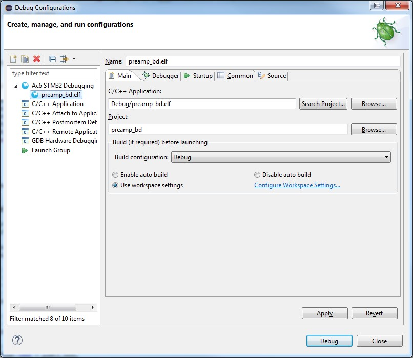
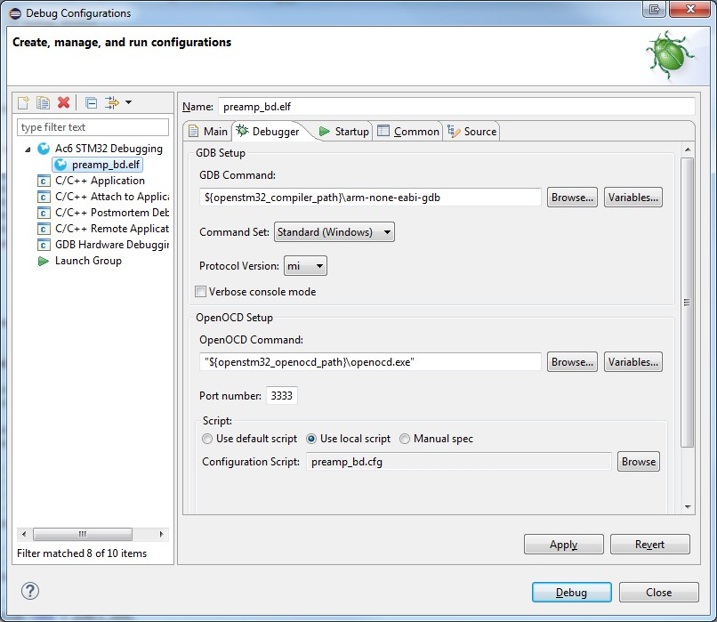
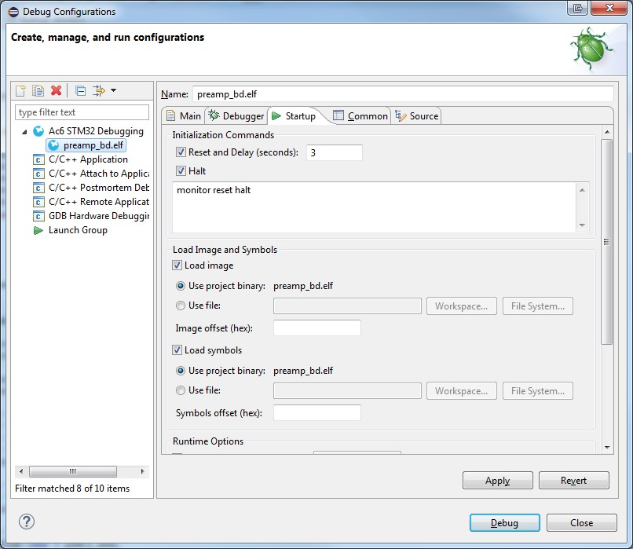
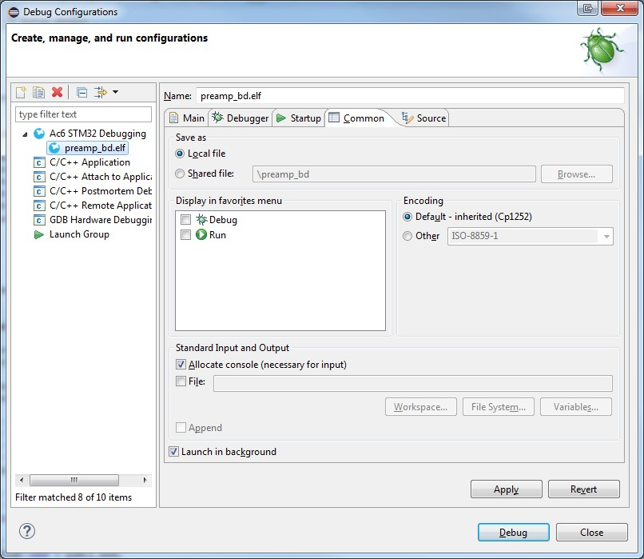

# Developing the preamp code for the AmpliPi Project
This guide will outline the procedure and required tools for preamp firmware development using the STM32 microcontroller
## 1. Required Tools
The microcontroller on the preamp board is an STM32F030R8 ARM Cortex M0 from ST Microelectronics. For initial programming, use the SWD debugger header on the preamp board (J8). We typically connect a Nucleo-F030R8 development board to this port and use it as an ST-LINK/V2-1 debugger/programmer. Be sure to line up pin 1 from the debugger with pin 1 on the preamp board debug port, noting that the cable is six pins wide, while the port on the preamp board is five pins wide - the sixth pin is not needed. Some helpful links can be found below:
The Nucleo board can be purchased/researched [here.](http://www.st.com/content/st_com/en/products/evaluation-tools/product-evaluation-tools/mcu-eval-tools/stm32-mcu-eval-tools/stm32-mcu-nucleo/nucleo-f030r8.html)
The STM32 ST-LINK Utility provides the ability to easily erase the flash and to reset the board when other software will not connect, among other things. Find it [here.](http://www.st.com/content/st_com/en/products/embedded-software/development-tool-software/stsw-link004.html)

## 2. IDE/Debugging
For preamp development, we used System Workbench for STM32 as our IDE. It is based on Eclipse, and can be found [here.](http://www.openstm32.org/System+Workbench+for+STM32)

Once you're in System Workbench, set the debug configuration according to the pictures below:

For the debugger to work properly, YOU MUST MODIFY stm32f0x.cfg. 

With System Workbench installed, it should be found in

'(root)/Ac6/SystemWorkbench/plugins/fr.ac6.mcu.debug_XXXX/resources/openocd/scripts/target/stm32f0x.cfg'

where (root) is the directory you installed it in.
Once this file is open, find this line: adapter_khz 1000
And change it to: adapter_khz 480

Once all of these steps are complete, the debugger should be functional! Within the IDE, it is possible to build and debug the project.

The build and debug options can be found in the toolbar at the top of the debugger, and they each come with multiple options. Build should work if the project was set up properly, even without a debugger.

